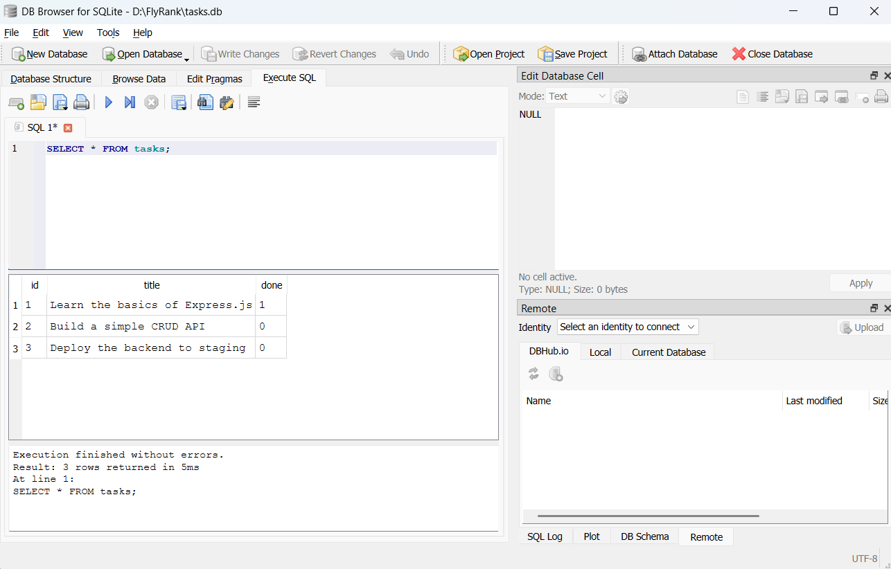
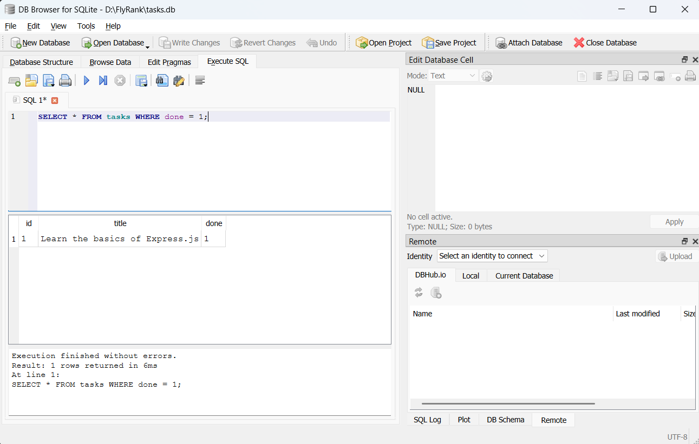
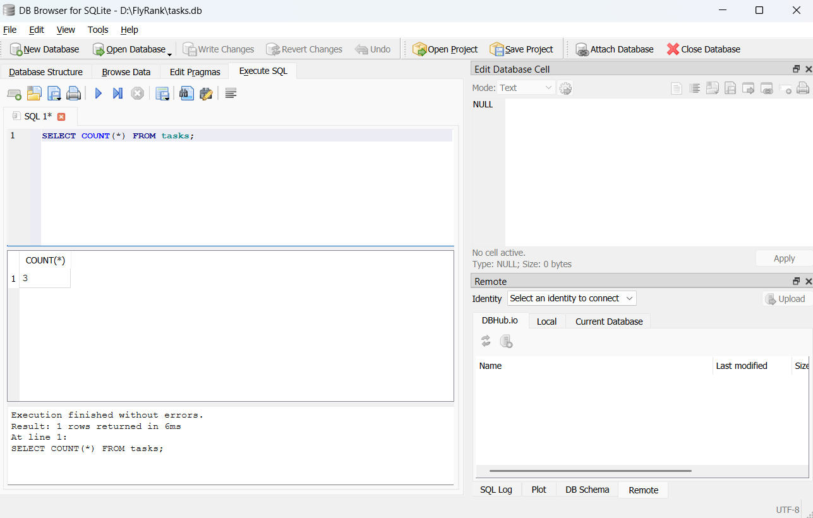
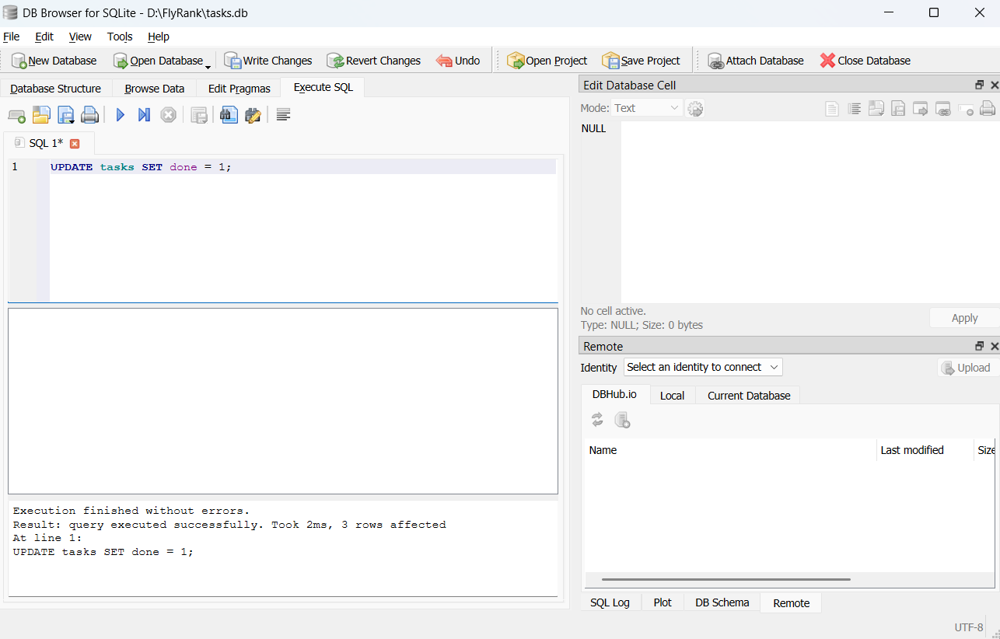
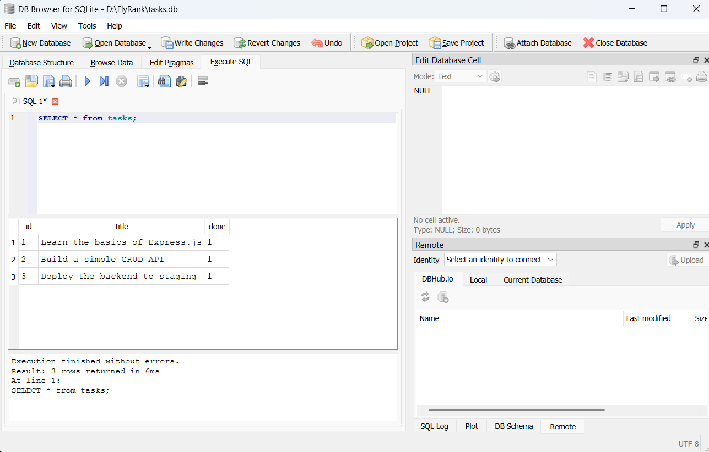
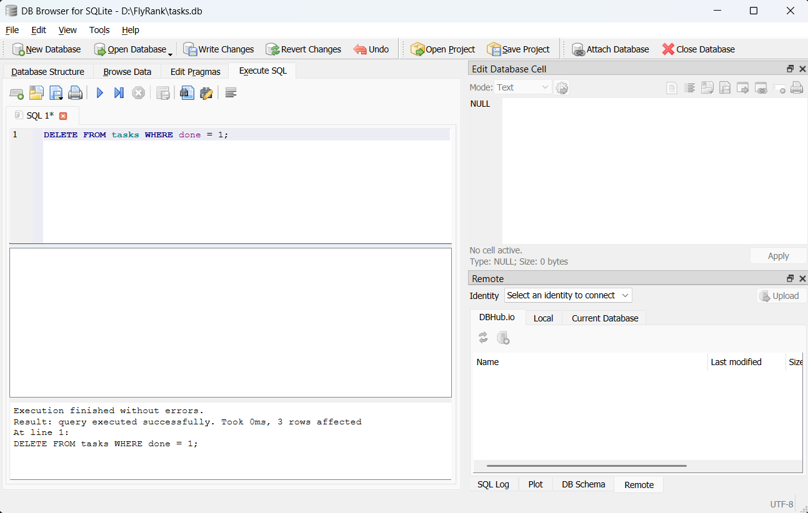
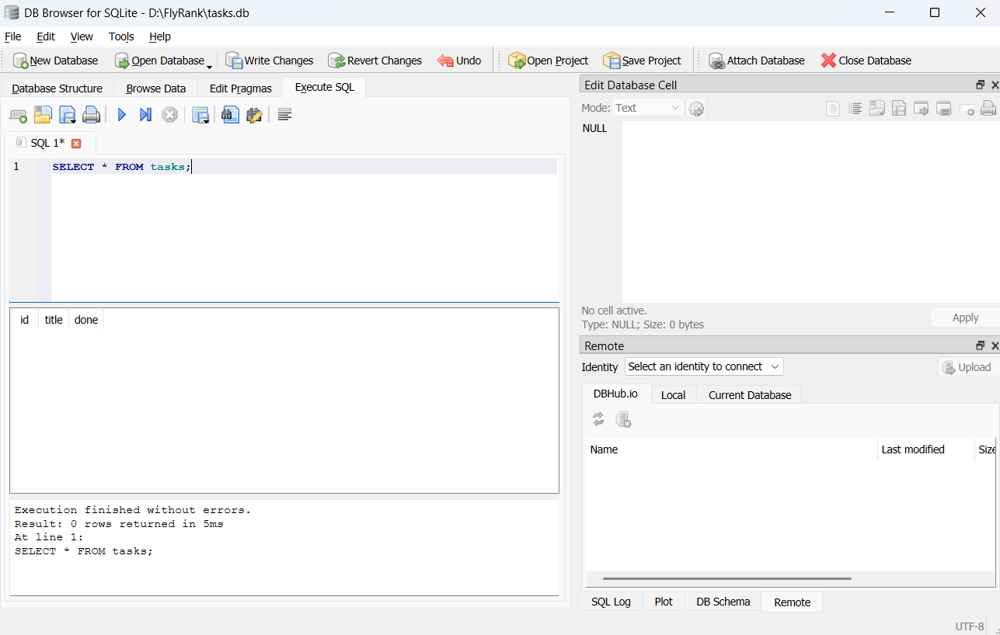

# Task CRUD API (SQLite Edition)

A simple REST API built with Node.js and Express to manage tasks, now upgraded to use a persistent SQLite database for Assignment A2. This project supports a full CRUD cycle, database persistence, task statistics, query-based filtering and searching, and interactive Swagger UI documentation.

---

## 1. Project Description

This is a Node.js + Express CRUD API for managing tasks. Originally built with in-memory storage, it has been migrated to SQLite to support data persistence across server restarts, while preserving all existing validation rules, status codes, and query logic.

---

## 2. Technologies Used

- **Node.js**
- **Express.js**
- **SQLite**
- **better-sqlite3** (for synchronous SQLite operations in ES Modules)
- **Swagger UI / OpenAPI 3.0**

---

## 3. Why SQLite?

SQLite was chosen for this project because:
- **Single-file database**: The entire database is stored in a single cross-platform file on disk (`tasks.db`).
- **No server setup**: It requires no external database server or daemon process to be configured, run, or managed.
- **Zero configuration**: It offers lightweight database persistence with zero external service dependencies.
- **Persistence**: Unlike in-memory arrays, it keeps task data intact across application restarts.

---

## 4. Database Setup & Seeding

- **Database File**: The database is stored locally in `tasks.db`.
- **Automatic Initialization**: The database file and the `tasks` table are created automatically when the application starts if they do not exist.
- **Automatic Schema Creation**: The table schema is defined as:
  - `id`: INTEGER PRIMARY KEY AUTOINCREMENT
  - `title`: TEXT NOT NULL
  - `done`: INTEGER DEFAULT 0 (representing the boolean status where `0 = false` and `1 = true`)
- **Seeding Protection**: When the table is initialized, exactly three default tasks are seeded **only if the table is empty** (i.e. row count is 0). This prevents duplicate seed data on server restarts.
- **Source of Truth**: The database is the single source of truth for all CRUD operations, statistics, and resets.
- **Git Ignored**: The `tasks.db` file is explicitly ignored in Git so that each local clone initializes its own independent database.

---

## 5. Installation

To set up the project locally:

1. **Navigate into the project folder**:
   ```bash
   cd FlyRank
   ```

2. **Install dependencies**:
   ```bash
   npm install
   ```

---

## 6. Running the API

Start the server using the standard project script:
```bash
npm start
```
The server will run at: **`http://localhost:3000`**.

---

## 7. API Endpoints

| HTTP Method | Endpoint | Description | Success Status | Error Status |
| :--- | :--- | :--- | :--- | :--- |
| **GET** | `/` | Retrieve API metadata | `200 OK` | - |
| **GET** | `/health` | Check API health status | `200 OK` | - |
| **GET** | `/tasks` | Get all tasks (supports query filters `done=true\|false` and `search=keyword`) | `200 OK` | `400 Bad Request` |
| **GET** | `/tasks/:id` | Get a task by its numeric ID | `200 OK` | `404 Not Found` |
| **POST** | `/tasks` | Create a new task | `201 Created` | `400 Bad Request` |
| **PUT** | `/tasks/:id` | Update a task's title and/or done status | `200 OK` | `400 Bad Request`, `404 Not Found` |
| **DELETE** | `/tasks/:id` | Delete a task | `204 No Content` | `404 Not Found` |
| **GET** | `/stats` | Retrieve dynamic task statistics | `200 OK` | - |
| **POST** | `/reset` | Re-seed the tasks table with the default 3 tasks | `200 OK` | - |

---

## 8. Persistence Demonstration

When you add a task using `POST /tasks`, the task is saved to `tasks.db`. You can verify persistence by:
1. Creating a new task (e.g. "Buy milk") via POST.
2. Stopping the server.
3. Restarting the server with `npm start`.
4. Fetching the task list via `GET /tasks`. The new task will still be present.

---

## 9. SQL Example

The following query retrieves all active (uncompleted) tasks:
```sql
SELECT * FROM tasks WHERE done = 0;
```
**Explanation**: This query selects all fields from the `tasks` table where the `done` integer is `0` (which maps to `false` in the application).

---

## 10. DB Browser Screenshots

Below are the screenshots from DB Browser for SQLite demonstrating the database structure, schema, and records across the different stages of the database lifecycle:


*Figure 1: Tasks table schema and default records in DB Browser for SQLite.*


*Figure 2: Viewing the seeded database tasks table after initial creation.*


*Figure 3: SQLite table state after initial query tests.*


*Figure 4: Created task state showing database auto-increment in action.*


*Figure 5: Persistence check after server restart.*


*Figure 6: SQLite table records reflecting task updates.*


*Figure 7: SQLite tasks table state after task deletion.*

---

## 11. Project Structure

```text
├── docs/                # SQLite database screenshots (db-screenhot1.png to 7)
├── node_modules/        # Installed dependencies
├── .gitignore           # Ignores node_modules, tasks.db, and SQLite temp files
├── index.js             # Express application and SQLite CRUD logic
├── openapi.json         # OpenAPI 3.0 specification file
├── package.json         # Project metadata and dependencies
├── package-lock.json    # Locked dependency tree
└── README.md            # Project documentation (this file)
```

---

## 12. Important Note

The database file `tasks.db` (along with transient files like `tasks.db-journal`) is intentionally excluded from the Git repository (via `.gitignore`). This ensures that the database is generated dynamically on startup on any host machine running this code, preventing conflicts and database corruption.
